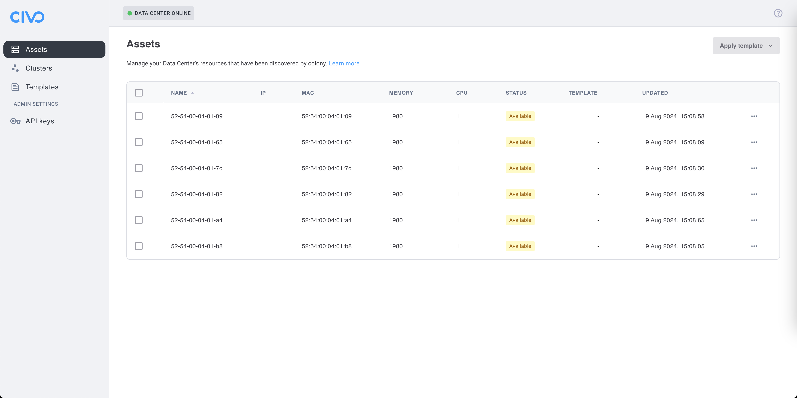
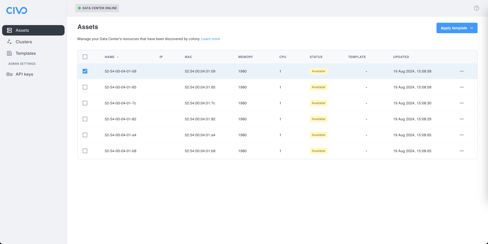
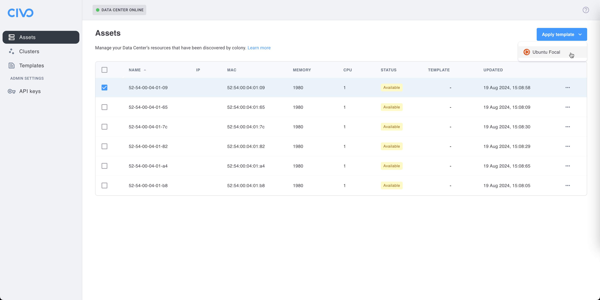
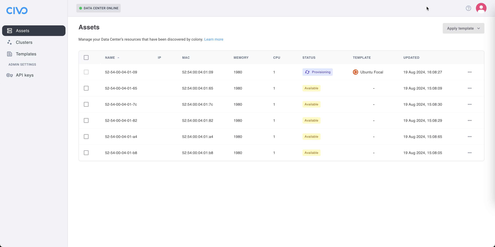
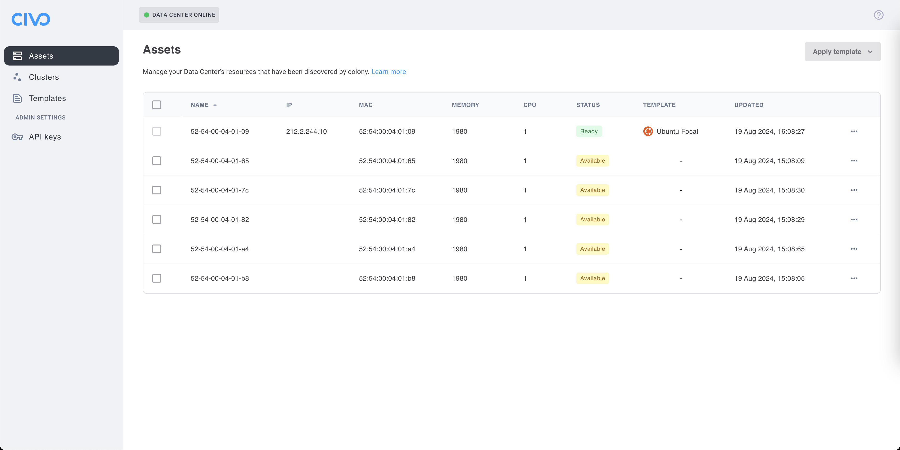

## Overview

Colony can provision Ubuntu 22.04 Jammy on bare metal assets using PXE boot and cloud-init. This is used for standalone servers.

## Prerequisites

Before provisioning Ubuntu:

- [ ] Management cluster initialized
- [ ] Assets discovered and in "available" status
- [ ] Network connectivity from management cluster to assets
- [ ] DHCP server configured for PXE boot

See [Discover Assets](../getting-started/discover-assets.md) if you haven't registered your hardware yet.

## Use Cases

### Standalone Servers

Use provisioned Ubuntu hosts for:

- **Application Servers**: Deploy apps directly on bare metal
- **Database Servers**: Run PostgreSQL, MySQL, MongoDB
- **Development Machines**: Remote development environments
- **Jump Boxes**: SSH bastions for infrastructure access
- **CI/CD Runners**: GitLab Runner, Jenkins agents

## Provision via UI

### Step 1: Navigate to Assets

1. Log in to [colony.konstruct.io](https://colony.konstruct.io)
2. Select your datacenter
3. Click **Assets** in the sidebar



### Step 2: Select Asset

1. Find an asset with "available" status (green)
2. Click the asset to open details
3. Click **Apply Template**

:::warning
Only assets in "available" status can be provisioned. Assets that are "provisioned", "provisioning", or "discovering" cannot have templates applied.
:::

### Step 3: Choose Ubuntu Template

1. From the template dropdown, select **Ubuntu Jammy** (or similar Ubuntu 22.04 template)
2. Review the configuration (defaults are usually fine)
3. Click **Provision**





The asset status will change to "provisioning".

### Step 4: Monitor Provisioning

Watch the provisioning progress:

- **Colony UI**: Asset details page shows status and logs
- **Timeline**: Expect 14-23 minutes for completion



Progress stages:
1. PXE boot and Ubuntu installer download
2. Disk partitioning and OS installation
3. Cloud-init configuration
4. Network setup and SSH enablement
5. First boot and system initialization
6. Status change to "provisioned"



## Provisioning Timeline

| Stage | Duration | Description |
|-------|----------|-------------|
| **PXE Boot** | 1-2 min | Asset boots from network, downloads Ubuntu installer |
| **Disk Prep** | 2-3 min | Partition disk, format filesystems |
| **OS Install** | 7-12 min | Install Ubuntu packages to disk |
| **Cloud-init** | 2-4 min | Apply configuration (users, SSH, network) |
| **First Boot** | 2-3 min | System initialization, services start |
| **Ready** | &lt;1 min | Status changes to "provisioned" |

**Total**: Approximately 14-23 minutes depending on network speed and hardware.

## Verification

### Check Status in UI

1. Navigate to **Assets**
2. Verify asset status shows "provisioned" (blue)
3. Note the assigned IP address
4. Confirm SSH is enabled (usually shown in details)

### Test SSH Access

Connect to the provisioned host:

```bash
ssh ubuntu@<asset-ip>
```

Default credentials:
- **Username**: `ubuntu`
- **Password**: `ubuntu`

You may be prompted to change the password on first login.

:::tip
For better security, configure SSH key-based authentication instead of passwords. Add your public key via cloud-init or after provisioning.
:::

### Verify System

Once connected, check the system:

```bash
# Check Ubuntu version
lsb_release -a
# Should show: Ubuntu 22.04.x LTS (Jammy Jellyfish)

# Check disk layout
df -h
# Should show mounted partitions

# Check network
ip addr show
# Should show configured IP address

# Check internet connectivity
ping -c 3 8.8.8.8

# Check DNS resolution
nslookup google.com

# Check SSH service
systemctl status sshd
# Should be active (running)
```

## Access Ubuntu Host

After provisioning completes, you have full SSH access:

### SSH with Password

```bash
ssh ubuntu@192.168.1.50
# Password: ubuntu
```

### SSH with Key (After Setup)

```bash
# Add your public key
ssh ubuntu@192.168.1.50 "mkdir -p ~/.ssh && echo 'YOUR_PUBLIC_KEY' >> ~/.ssh/authorized_keys"

# Connect with key
ssh -i ~/.ssh/id_rsa ubuntu@192.168.1.50
```

### Become Root

```bash
# The ubuntu user has sudo access
sudo su -

# Or run commands with sudo
sudo apt update
```

## Post-Provisioning Configuration

### Update Packages

```bash
sudo apt update
sudo apt upgrade -y
```

### Install Additional Software

```bash
# Development tools
sudo apt install -y build-essential git curl wget

# Docker (if needed)
curl -fsSL https://get.docker.com | sh
sudo usermod -aG docker ubuntu

# Other packages
sudo apt install -y vim tmux htop
```

### Configure SSH Keys

```bash
# Generate key on your local machine
ssh-keygen -t ed25519 -C "your-email@example.com"

# Copy to Ubuntu host
ssh-copy-id ubuntu@<asset-ip>

# Test key-based auth
ssh ubuntu@<asset-ip>
```

### Set Hostname

```bash
# Set a friendly hostname
sudo hostnamectl set-hostname myserver.example.com

# Update /etc/hosts
echo "192.168.1.50 myserver.example.com myserver" | sudo tee -a /etc/hosts
```

## Use Cases After Provisioning

### Deploy Applications

Use as a standalone server:

```bash
# Example: Deploy nginx
sudo apt install -y nginx
sudo systemctl start nginx
sudo systemctl enable nginx

# Access via browser
curl http://<asset-ip>
```

### Set Up Database

```bash
# Example: PostgreSQL
sudo apt install -y postgresql postgresql-contrib
sudo systemctl start postgresql
sudo systemctl enable postgresql

# Access PostgreSQL
sudo -u postgres psql
```

### Run Docker Containers

```bash
# Install Docker
curl -fsSL https://get.docker.com | sh

# Run a container
docker run -d -p 8080:80 nginx

# Access via browser
curl http://<asset-ip>:8080
```

## Deprovisioning

To wipe the asset and return it to "available" status:

### Via UI

1. Navigate to **Assets**
2. Select the provisioned asset
3. Click **Wipe Disk**
4. Confirm the action
5. Wait for status to change back to "available" (5-10 minutes)

:::danger
Wiping a disk is destructive and irreversible. All data will be permanently deleted. Ensure you have backups if needed.
:::

### What Wipe Does

- Overwrites disk with zeros or random data
- Destroys all partitions and filesystems
- Removes all operating system files
- Resets asset to factory state
- Asset becomes available for new provisioning

## Troubleshooting

### Provisioning Fails

**Symptoms**: Asset stuck in "provisioning" status or returns to "available" with error.

**Solutions**:
- Check Tinkerbell workflow logs: `kubectl get workflows -A`
- Verify DHCP server is responding to PXE requests
- Ensure TFTP server is reachable from asset
- Check asset IPMI is accessible with `ipmitool -H <ipmi-ip> -I lanplus -U admin -P $PASS power status`
- Review Ubuntu mirror connectivity (assets need internet)

### SSH Connection Refused

**Symptoms**: Can't connect to asset after provisioning.

**Solutions**:
- Verify asset status is "provisioned" (not "provisioning")
- Check asset IP is correct and pingable: `ping <asset-ip>`
- Ensure SSH port (22) is not blocked by firewall
- Wait a few more minutes (cloud-init may still be running)
- Check SSH service via IPMI console: `systemctl status sshd`

### Wrong IP Address

**Symptoms**: Asset has unexpected IP or no IP.

**Solutions**:
- Check DHCP server configuration and lease table
- Verify network interface is connected to correct VLAN
- Check cloud-init network configuration
- Manually configure static IP if DHCP issues persist

### Disk Full or Wrong Partition Layout

**Symptoms**: `/` filesystem is too small, or partitions are wrong size.

**Solutions**:
- Wipe asset and re-provision
- Customize cloud-init to modify partitioning (advanced)
- Check disk size is sufficient (minimum 20GB, recommended 64GB+)

### Package Installation Fails

**Symptoms**: `apt install` fails with errors.

**Solutions**:
- Update package lists: `sudo apt update`
- Check internet connectivity: `ping 8.8.8.8`
- Verify DNS works: `nslookup ubuntu.com`
- Check disk space: `df -h` (need at least 1GB free)
- Try different Ubuntu mirror if needed

## What's Next

Now that you have Ubuntu provisioned:

- [Asset Management →](./index.md) - Learn about asset lifecycle
- [Networking Configuration →](./networking.md) - Configure advanced networking
- [Create Clusters →](../clusters/index.md) - Deploy Kubernetes clusters

Need help? [Join our Slack community](https://konstructio.slack.com/) for support!
