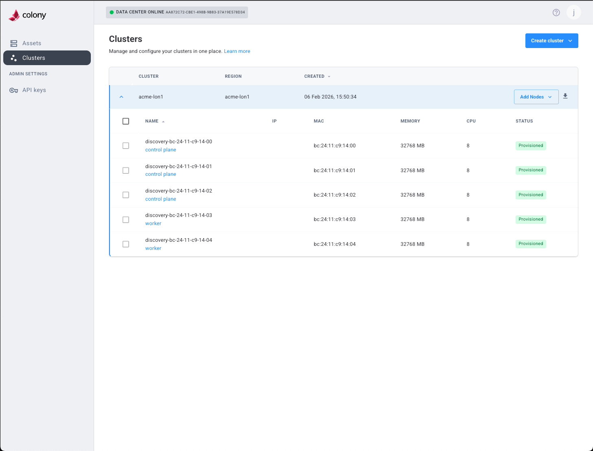

## Overview

Colony allows you to add nodes to existing clusters to scale capacity or improve high availability. The process varies by cluster type.

## Prerequisites

Before adding nodes:

- [ ] Existing cluster is healthy and operational
- [ ] Additional assets available (status: "available" or "provisioned" for K3s)
- [ ] Assets meet minimum requirements for cluster type
- [ ] Network configuration ready (static IPs, DNS, etc.)

## Add Nodes via UI

### Step 1: Navigate to Cluster

1. Log in to [colony.konstruct.io](https://colony.konstruct.io)
2. Click **Clusters** in sidebar
3. Select your cluster
4. Click **Add Nodes** or **Scale Cluster**




### Step 2: Choose Node Type

Select what to add:

- **Control Plane Node**: Adds to etcd quorum and API server
- **Worker Node**: Adds capacity for workloads

:::tip
For high availability, aim for 3 or 5 control plane nodes (odd numbers). Add workers as needed for workload capacity.
:::

### Step 3: Configure New Nodes

Similar to cluster creation:

1. Select available assets
2. Assign static IPs
3. Configure network settings (DNS, NTP)
4. Specify disk device

For K3s clusters, also provide SSH public key.


### Step 4: Review and Add

Review configuration and click **Add Nodes**.

## Cluster-Specific Notes

### Civo Stack (Talos)

- Nodes PXE boot and install Talos automatically
- Join cluster using existing machine config
- CSE components automatically deploy to new nodes
- Timeline: 15-25 minutes per node

### K3s

- Assets must already have Ubuntu 22.04 provisioned
- K3s installed via SSH
- Workers join using token from control plane
- Timeline: 5-10 minutes per node

### Talos Linux

- Nodes PXE boot and install Talos automatically
- Join cluster using existing machine config
- Remember to install CNI if not already present
- Timeline: 8-15 minutes per node

## Verify New Nodes

### Check Node Status

```bash
# List all nodes
kubectl get nodes

# Watch nodes become Ready
kubectl get nodes -w
```

New nodes should appear and transition to "Ready" status.

### Verify Workload Distribution

```bash
# Check pods distributed across nodes
kubectl get pods -A -o wide

# Verify scheduler uses new nodes
kubectl get events --sort-by='.lastTimestamp'
```

## Troubleshooting

### Node Won't Join

**Symptoms**: New node doesn't appear in `kubectl get nodes`.

**Solutions**:

- Verify asset provisioning completed successfully
- Check network connectivity to control plane
- Review colony-agent logs
- For K3s: Verify SSH access works
- For Talos: Check talosctl node status

### Node Stuck NotReady

**Symptoms**: Node appears but stays NotReady.

**Solutions**:

- For Talos Linux: Ensure CNI is installed
- Check kubelet logs: `kubectl logs -n kube-system kubelet-<node>`
- Verify node can reach API server
- Check for resource constraints (CPU, memory)

### Workloads Not Scheduling

**Symptoms**: Pods don't schedule to new nodes.

**Solutions**:

- Check node taints: `kubectl describe node <node-name>`
- Verify node has sufficient resources
- Check pod resource requests match node capacity
- Review scheduler logs

## Remove Nodes

To remove nodes from a cluster:

### Drain Node

```bash
# Gracefully evict pods
kubectl drain <node-name> --ignore-daemonsets --delete-emptydir-data
```

### Delete Node

```bash
# Remove from cluster
kubectl delete node <node-name>
```

### Deprovision Asset

Via Colony UI:

1. Navigate to **Assets**
2. Select the node's asset
3. Click **Wipe Disk**
4. Confirm action

Asset will return to "available" status for reuse.

## What's Next

- [Cluster Provisioning Overview →](./index.md)
- [Asset Management →](../assets/index.md)

Need help? [Join our Slack community](https://konstructio.slack.com/) for support!
