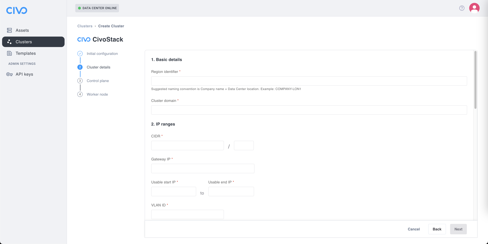

# Clusters

One possibility for the machines discovered by colony is to be able to create new clusters. For now, we only support the CivoStack, but more options will be available in the future. If you have any suggestions, feel free to let us know in the `#colony-clusters` channel in our [Slack community](https://kubefirst.io/slack).

## CivoStack

You can deploy the equivalent of the [CivoStack Enterprise](https://www.civo.com/civostack-enterprise) on your own data center.

### Creating your cluster

To do so, choose the "Clusters" menu item in the sidebar.

Click on the "Create cluster" dropdown menu and select "CivoStack".

Before you can deploy the CivoStack on your machines, you will need to provide some information.

#### Initial Configuration

On the first screen, you will need to provide an IP for the global gateway which will act as a bridge between networks.

Optionally, you can add extra Subject Alternative Names (SANs). SAN entries are used to specify additional DNS names or IP addresses that should be part of the certificate generated for Kubernetes.

#### Cluster details

Once you click the "Next" button, you'll end up on the "Cluster details" step.

##### Basic details

Firstly, you need to enter two required information. The first one is the "Region identifier" which will be displayed as a new region in your Civo dashboard. The suggested convention for the name is `<Company Name><Data Center location><Number of the location>` all in lower cases (example: `konstruct-wash1` for our first data center located in Washington).

Secondly, you need to add a domain that will be use to make your cluster available from the outside world. The domain need to be managed by Civo, which mean having the DNS point to Civo, and the domain added to the DNS page from the Networking section of your Civo Dashboard.

##### IP ranges

In this section, you need to enter IP information, and all fields are required. The first item, the Classless Inter-Domain Routing (CIDR) need to have its IP address, and the subnet mask. You also need to provide the gateway IP, in addition to the start and end of the IP range available for CivoStack.

##### Whitelist policy

This section is optional, but important security-wise. It's there you can specify IPs that will have access to Ingress services (Ingress whitelist IPs) and your CivoStack (Default firewall whitelist IPs). In both cases you can specify the IPs singlely or with CIDR nomenclature, separated by commas. If left empty, all IPs will have access.

##### Storage

Lastly for the cluster details step, you can also provide information for [Mayastor](https://github.com/openebs/mayastor) pool disks, including the node name, disk-by-id identifier and the IDs for the data plane node isolation. For more information on how to retrieve these information, check the information in the repository [README](https://github.com/openebs/mayastor/blob/develop/README.md).

There is also an option to include Ceph pool disks information. CivoStack will need the node name, and the disk-by-id identifier. For more information on how to retrieve these information, check [their official documentation](https://docs.ceph.com/en/latest/).

In the storage department, a last option is available to you: using a [Wasabi cloud object storage](https://wasabi.com/cloud-object-storage). To do so, please provide the bucket ID, and the access key/secret. For more information on how to retrieve these information, check [their official documentation](https://docs.wasabi.com).

#### Control plane

For your CivoStack to work properly, you need to select at least one asset where your cluster's control plan will be deployed. For high availability, you can select multiples, but you will need to leave at least one asset free for the next step, the selection of the worker node.

To select one or more asset, click the associated checkbox. You will need to provide a static IP, and select which available disk will be used. If you didn't provide a global gateway IP at the "Initial configuration" step, you will be required to provide one for each control plane.

#### Worker Node

The last step of the  your CivoStack to work properly is to define your worker node(s) (clusters). To select one or more asset, click the associated checkbox. You will need to provide a static IP, and select which available disk will be used. If you didn't provide a global gateway IP at the "Initial configuration" step, you will be required to provide one for each worker node.

Once you are ready, click on the "Create CivoStack" button. You will be returned on the clusters page where you can see your new CivoStack cluster being provisioned.

### Your CivoStack cluster

TBD once I'll be able to create a CivoStack cluster.
