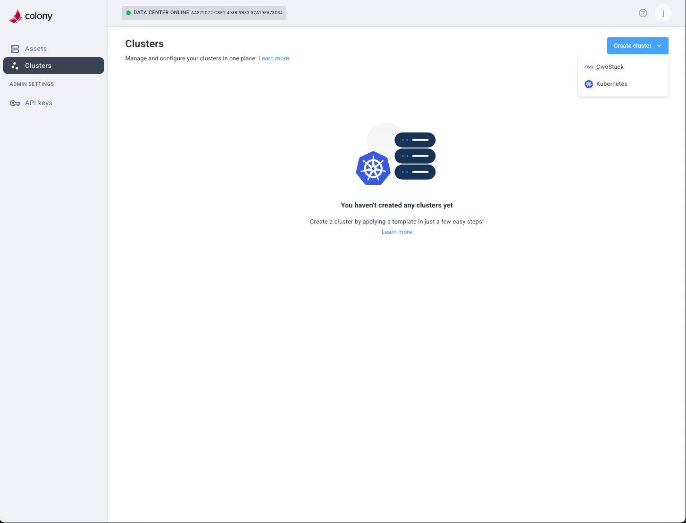

## Overview

The Colony UI at [colony.konstruct.io](https://colony.konstruct.io) provides a web-based interface for managing your bare metal infrastructure and Kubernetes clusters.

## Dashboard

After logging in, the dashboard shows:

- **Datacenters**: Your registered datacenters
- **Quick Stats**: Assets, clusters, workflows
- **Recent Activity**: Latest operations and events

## Navigation

### Sidebar Menu

- **Dashboard**: Overview and quick access
- **Assets**: Hardware inventory and provisioning
- **Clusters**: Kubernetes cluster management
- **Workflows**: Provisioning job status and logs
- **API Keys**: Authentication credential management
- **Settings**: Account and datacenter configuration

## Assets View

### Asset List

Shows all discovered assets with:

- Hostname or hardware ID
- Status (discovering, available, provisioned)
- IP address
- Hardware specs (CPU, RAM, disk)
- Actions (provision, wipe, details)

### Asset Details

Click an asset to view:

- Full hardware inventory
- Network configuration
- IPMI connection status
- Provisioning history
- Current status and logs

### Asset Actions

- **Apply Template**: Provision Ubuntu or other OS
- **Wipe Disk**: Return asset to available status
- **View Logs**: See provisioning or operation logs

## Clusters View

### Cluster List

Shows all clusters with:

- Cluster name
- Type (Civo Stack, K3s, Talos Linux)
- Status (provisioning, ready, error)
- Node count
- Age
- Actions (view, scale, delete)

### Cluster Details

Click a cluster to view:

- Node list with IPs and roles
- Provisioning status and timeline
- Configuration details
- Workflow logs
- Download kubeconfig and talosconfig

### Cluster Actions

- **Download Kubeconfig**: Access cluster with kubectl
- **Download Talosconfig**: Manage Talos nodes (Talos clusters)
- **Add Nodes**: Scale cluster
- **Delete Cluster**: Remove cluster (doesn't wipe assets)

## Workflows View

Shows provisioning jobs:

- Workflow ID
- Type (cluster-provision, os-provision, disk-wipe)
- Status (pending, running, completed, failed)
- Start/end time
- Duration
- Logs

Click a workflow to see detailed execution logs.

## API Keys View

Manage authentication:

- **Create New API Key**: Generate credentials
- **View Keys**: See existing keys (partially masked)
- **Revoke Key**: Disable compromised credentials
- **Description**: Label keys for organization

## What's Next

- [CLI Reference →](./cli-reference.md)
- [Create Clusters →](../clusters/index.md)
- [Troubleshooting →](./troubleshooting.md)
