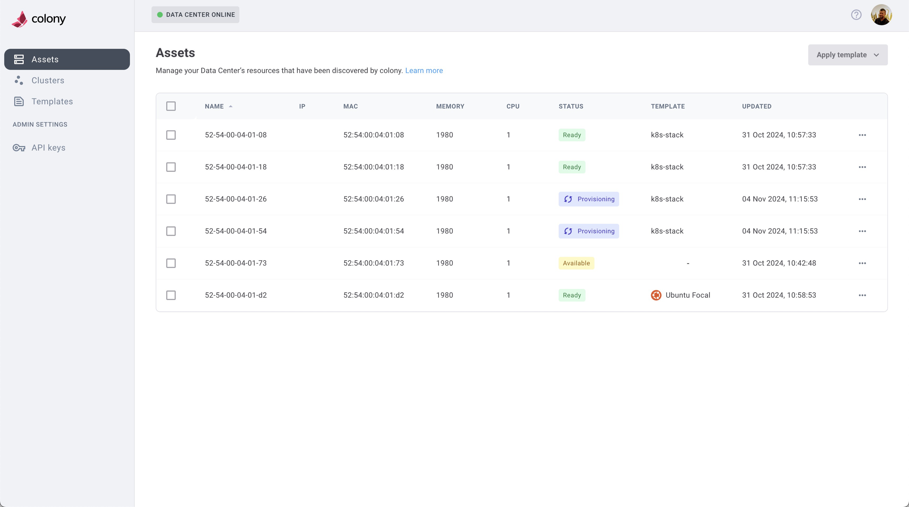

## What is Colony?

Colony is a bare metal provisioner and data center infrastructure management system. It's a cloud native microservice ecosystem with some components hosted in Civo and other components that run in your data centers.

Colony provides you a way to easily manage bare metal OS provisioning and deprovisioning operations in your own data centers.

## Quick Start

Ready to deploy Colony? Follow these steps:

1. **[Install the CLI](./install/cli.md)** - Download and install the Colony command-line tool
2. **[Create API Key](./getting-started/api-key.md)** - Get the `colony init` command
3. **[Initialize Management Cluster](./install/management-cluster.md)** - Setup colony and its supporting components
4. **[Discover Assets](./getting-started/discover-assets.md)** - Register your hardware
5. **[Create Clusters](./clusters/index.md)** - Deploy Kubernetes on bare metal

Or start with the **[Getting Started Guide](./getting-started/index.md)** for a complete walkthrough.

## Features

### Multiple Cluster Types

Colony supports three Kubernetes distributions:

- **[Civo Stack](./clusters/civo-stack/index.md)**: Enterprise: Repurpose your existing datacenter as private cloud
- **[K3s](./clusters/k3s/index.md)**: Lightweight Kubernetes on Ubuntu
- **[Talos Linux](./clusters/talos/index.md)**: Container Linux for Kubernetes

### Bare Metal Management

- **Asset Discovery**: Automatic hardware detection via IPMI
- **OS Provisioning**: Install Ubuntu or Talos via PXE boot
- **Cluster Lifecycle**: Create, scale, and delete clusters
- **Network Configuration**: Static IPs, DNS, NTP, VLANs

### Cloud-Native Architecture

- **Hosted API**: Central management at [colony.konstruct.io](https://colony.konstruct.io)
- **Local Agent**: Runs in your datacenter for security and performance
- **Kubernetes-Native**: Built on K3s, Tinkerbell, and cloud-native tools

## Getting Support

Do you have questions before you get started? Did you run into an issue that is keeping you from using Colony? We can help!

- **[Contact Civo](https://www.civo.com/contact)** - Get in touch with our team for support
- **[Join our Slack Community](https://konstructio.slack.com/)** - Connect with other users and get answers
