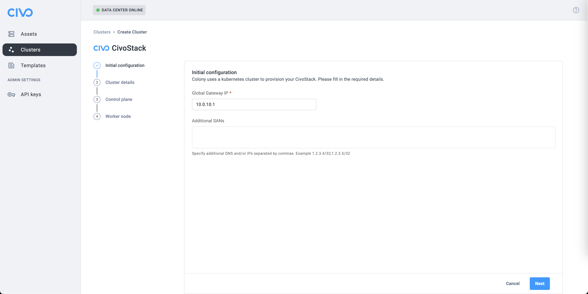
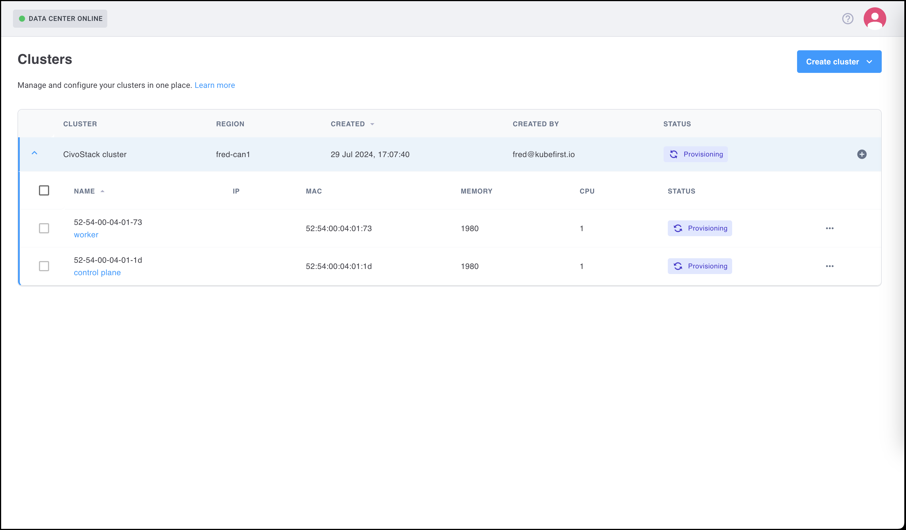

## Summary

After reviewing the [required prerequisites](../colony-prod/prereqs-colony.md), refer to the details below to install Colony.

## Step 1 - Installing Colony

The following installation instructions apply to Colony version 0.02-rc1.

    ```bash
    git clone -b ipmi https://github.com/konstructio/colony.git
    cd colony
    go build .
    ```

## Step 2 - Create Your API Key

1. Navigate to `https://colony.konstruct.io/`
2. Log in with any of the options listed, this step creates your data center (and unique ID for the data center)
3. Go to **API Keys** and select **Create New API Key**.

**Save this information in a safe place, it only displays once.**

## Step 3 - Run the Colony `init`

    ```bash
    ./colony init \
    --api-key $YOUR_COLONY_API_KEY \
    --load-balancer-interface <asset-managment-interface> \
    --load-balancer-ip <ip-address>
    ```
 
    ```bash
    export KUBECONFIG=~/.colony/config
    ```

To manually patch the colony-agent image until we publish a new release

    ```bash
    kubectl -n tink-system set image deployment/colony-colony-agent \
    colony-agent=ghcr.io/konstructio/colony-agent:93fde8b
    ```

### Items to Note

    - `<interface>` refers to the interface connected to `network boot`.
    - The IP address should be in the same subnet as the assets being discovered.
    - This is the address of the `next-server` (tftp server). Refer to the following to [generate API keys](https://colony.konstruct.io/docs/install/virtual-install)

## Step 4 - Asset Discovery

To discover an asset run:

    ```bash
    ./colony add-ipmi \
    --ip <asset-managment-address> \
    --username <username> \
    --password <ipmi-password> \
    --auto-discover
    ```

The new asset will appear under the assets tab in the Colony UI.

## Step 5 - Adding a Cluster

After your Assets are discovered and listed as available you can use them to provision a cluster. You must have a minimum of two Assets to create a cluster (one for the Control plane and one for the Worker node).



1. Select **Create Cluster** to start this process.
2. Complete Cluster details, Control plane details, and Worker node information as desired.
3. Select **Create CivoStack**** to complete this process.


