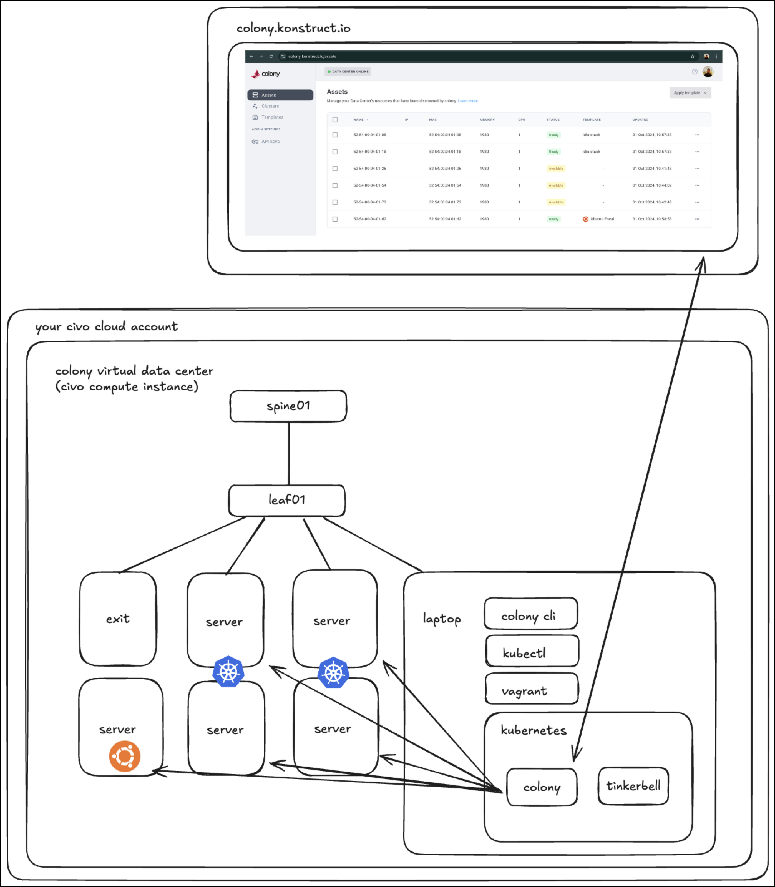

## How does the Vagrant VM work?

After the virtual data center setup completes there will be a small virtual rack of servers, including an exit node, a spine leaf network, and 5 virtual machines (VM) that are still waiting to be turned on and auto-enrolled with Colony.

The first part of the install is a setup that puts you on a VM “laptop” to emulate the experience of using Colony in a data center.

Your VM “laptop” is loaded with tools like: 
 - Docker
 - Helm
 - Kubectl - We add an alias for this 
 - Tinkerbell (tink stack) 
 - K3d (soon to be k3s)
 - Kubens
 - Colony CLI 

Check out the details in the repo [in the setup here.](https://github.com/konstructio/colony-vagrant/blob/5182ef647fab8cffa17147a73ea6270da05c66fe/laptop/setup.sh#L3-L103) 

## Vagrant VM diagram

