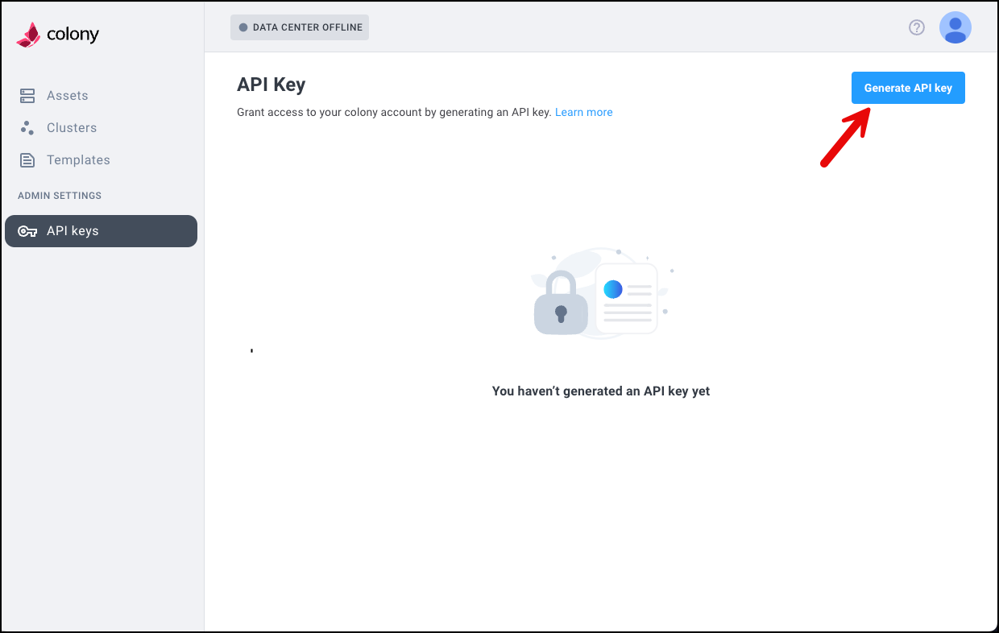

# Installing Colony

## Summary
This installation guide walks through what you need to install Colony into a repeatable Vagrant virtual environment. The virtual data center `colony-vagrant` creates an environment that you can host on a single Civo compute instance to explore Colony

*We’re working to expand support for this virtual data center to include AWS soon.*

## What you’ll need
To be able to run this virtual environment for Colony you’re going to need the following:

 - Git (Run `brew install git`)
 - Make (Run `brew install make`) 
 - A [Civo API key](https://www.civo.com/docs/account/api-keys) 
 - A Colony API token (*details on creating this below*)

### Generate your Colony API Key 
Logging in to Colony for the first time creates your account and gives you access to create an API Key. Accounts can be created by logging in with: Civo, GitHub, GitLab, or Google.

Complete the steps to generate a new Colony API Key

1. Log in to Colony (https://colony.konstruct.io/)
2. Navigate to **API Keys** and select **Generate API Key**



3. Once created, **copy and save the key** to use in your Colony install.

## Steps to install Colony

Follow the steps below to launch a virtual Vagrant environment.

1. Run the following command to clone the Vagrant repo for Colony.

```git
git clone https://github.com/konstructio/colony-vagrant
```
2. Navigate to the directory for the repo and make your datacenter.

```
cd colony-vagrant
make dc
```
3. In the terminal, **select a region**. (*We typically use `nyc1`*)
4. Add your **Civo API Key**
5. Enter your default **SSH key** (or your own/explicit key)
6. Enter **a name** for your datacenter instance.
7. Add your **Colony API Key**
8. Select the default **Colony CLI**
9. Click to select **Create datacenter**

⏲️ *The process to create your virtual datacenter typically takes about 10 minutes.*

## What's next?

- Check out what's [included with the Vagrant VM](vagrant.md)
- Skip ahead and [start using Colony to discover assets](/clusters/index.md)