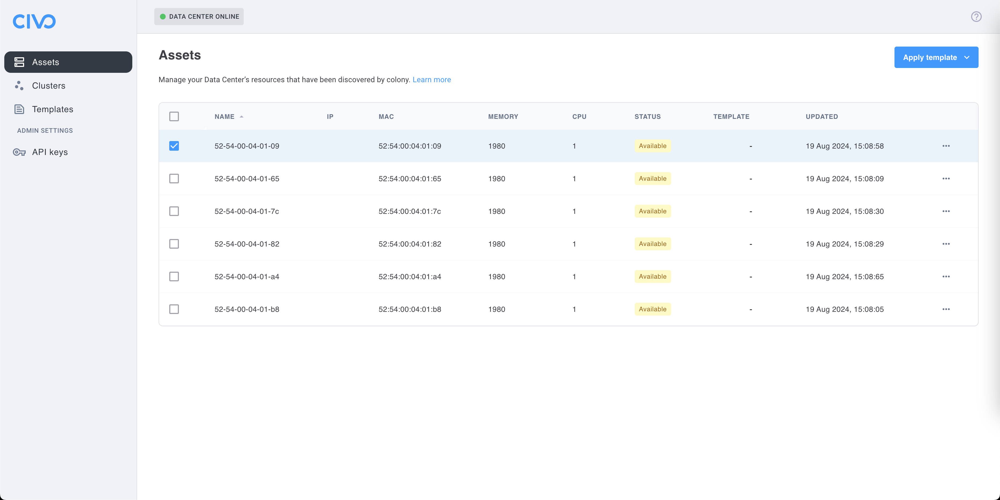
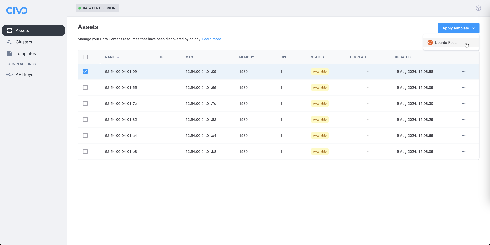
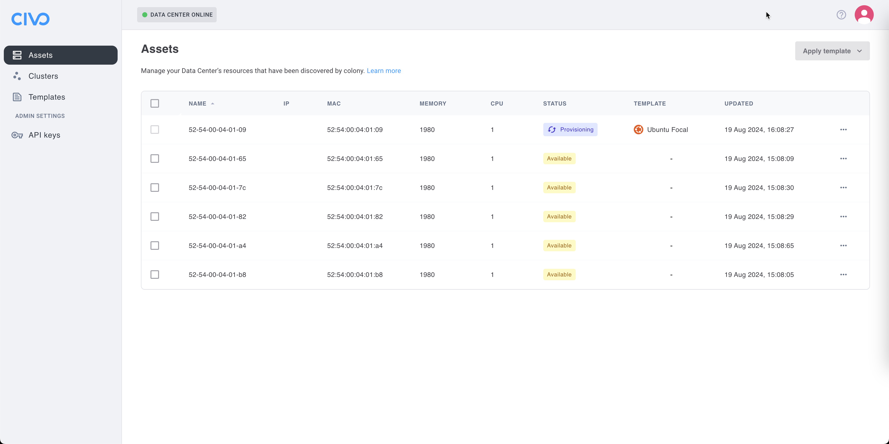
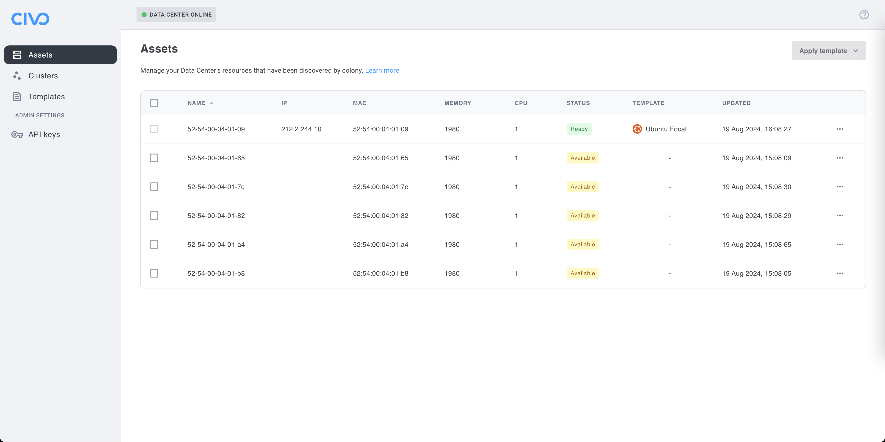

# Templates

One thing you can do with the machines discovered by colony is to use one of our available templates to install a specific operating system easily on one or multiple machines. For now we only support [Ubuntu](https://ubuntu.com), but more templates, like [Talos Linux](https://www.talos.dev), will be added soon. If you have any suggestions, feel free to let us know in the `#colony-templates` channel in our [Slack community](https://kubefirst.io/slack).

## Ubuntu

The first thing you need to do is to select one or multiple assets where you want to deploy Ubuntu.

Once it's done, click on the "Apply template" dropdown menu, and select "Ubuntu Focal".

The installation of Ubuntu on your selected assets will begin. It may take a while, so feel free to do something else while it's applying the template.

Once it's provisioned, the state of the selected asset will go from "Provisioning" to "Ready". The interface will now show the assigned IP of the machines you used for the template. You can now SSH into said machine, and use it as you see fit.
