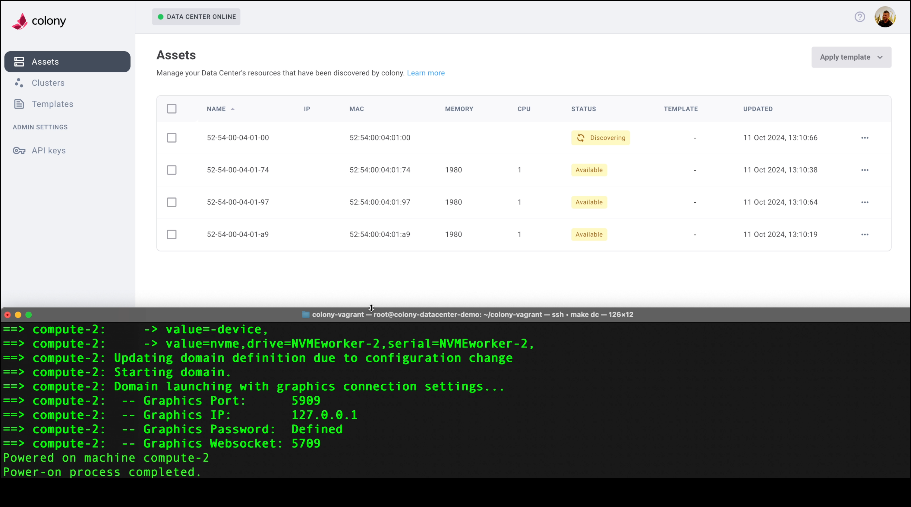

# Summary
After successfully installing the virtual Vagrant environment you're ready to start discovering assets with Colony and adding configurations.

## Discovering Assets

Now that everything is installed and your VM “laptop” is up and running you’re going to connect the data center to Colony.

1. Run the following command to connect your data center to Colony

```
colony init -–apiKey= $COLONY_API_KEY –apiURL=https//colony-api-virtual.konstruct.io
```
2. Next, exit to return the shell back to the data center.
   
```
exit
```
3. Finally, from the data center context run this command to turn on one of the reserved servers every 30 seconds, and auto-enroll them with Colony, making them available for provisioning operations.

```bash
bash ./virtual-datacenter/power-on.sh
```

:::info
If you connect to Colony and (*in the UI*) nothing appears after a minute or two there’s definitely an issue with the setup. Get in touch with us and we’ll be happy to get you sorted out. 
:::

4. Now imagine you’re walking around in the data center to “turn on” the virtual machines. 
- This process is smaller in scale and slower than it would be in an actual data center because of the constraints of the testing environment and all of the functionality we’ve built in for the virtual environment but it works exactly the same. 

You should see something like this:



## Creating Clusters

After your assets are all listed as “discovered” you can navigate to the **Clusters page** in the sidebar and we can show you how easy it is to use Colony to create a new cluster (*in this example we’ll use Talos as a demo)

:::note
In a real-world set up data centers have network segmentation rules governing the IP address ranges in use. 
:::

1. Select **Create Cluster** and choose **Kubernete**s from the menu to open the initial configuration. *For this example we’re going to create a new cluster with Talos.*
2. Complete the cluster details as follows:
    - Select a cluster type - Talos (*simplicity and security*) 
    - Cluster Name - talos-demo (*or something similar*) 
    - Global Gateway IP - 10.0.10.1 (*static for the vagrant data center environment*) 
    - Additional SANS (*not required*) 
3. Select **Next** to continue to select a Control Plane (*you can choose one or multiples, these instructions are for one*) 
4. Select the top disk (the multi-disk setup is just to show support)
   - Static IP for all the VMs --> 10.0.10.20/24
5. Select **Next** to continue to the Worker Node.
   - Static IP 10.0.10.21/24

**While it’s provisioning you will see Colony starting up the worker and control plane nodes. **

## Deprovisioning

To remove Colony you will need to destroy the assets that were created in Colony and in Civo to avoid accumulating cloud costs. 

:::tip
The Civo instance that hosts this virtual environment costs just under $1 to run for 4 hours, which is plenty of time to create some new bare metal Kubernetes clusters and add a hello world. 
:::

1. To destroy your data center, run the `exit` command in your terminal to log off of the laptop. 
2. Then run the `exit` command again to leave the data center.
3. These commands  drop you back into the interactive `colony-vagrant` shell which will allow you to select `option > destroy datacenter`. 
4. Select enter to clean up your virtual data center in the cloud including the Assets and any clusters that you created related to the Assets. 