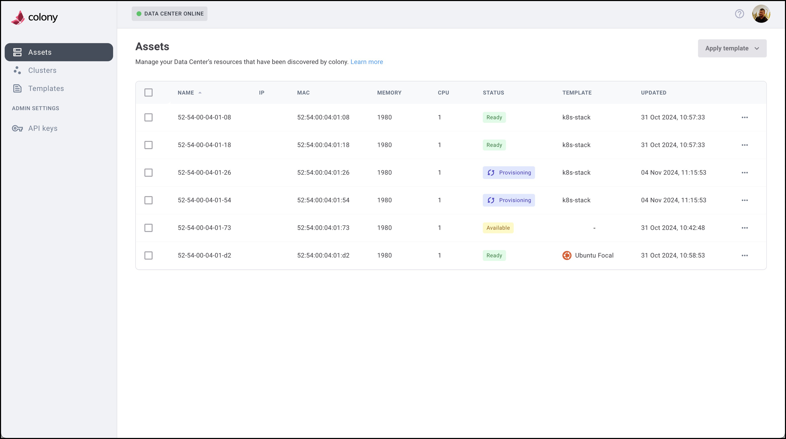

:::tip

Colony is currently in beta. Beta is currently **open and free**, but subsequent releases are expected to include a paywall.

If you're interested in using Colony and still have questions, we're here to help!
[Join our Slack Community](https://konstructio.slack.com/) for more information.

:::

# What is Colony?

Colony is a bare metal provisioner and data center infrastructure management system. It's a cloud native microservice ecosystem with some components hosted in Konstruct and other components that run in your data centers.

Colony provides you a way to easily manage bare metal OS provisioning and deprovisioning operations in your own data centers.

- Read [our blog on Colony.](https://blog.konstruct.io/virtual-data-center/)
- Check out [the Product page](https://konstruct.io/colony) to learn more and request a demo.

## Getting Support

Do you have questions _before_ you get started? Did you run into an issue that is keeping you from using Colony? We can help! [Join our Slack Community](https://konstructio.slack.com/) for support and get the answers you need!

## Contribute to Colony Docs

Colony documentation is a work in progress. The content reflects the options we
support, which will be updated as functionality expands.

Our Colony documentation is open source and we're always interested in hearing your
feedback or implementing your recommendations, even if it's just a typo. Check out [our contribution guide](https://github.com/konstructio/colony-docs/blob/main/CONTRIBUTING.md) to
learn more about sharing your input.
