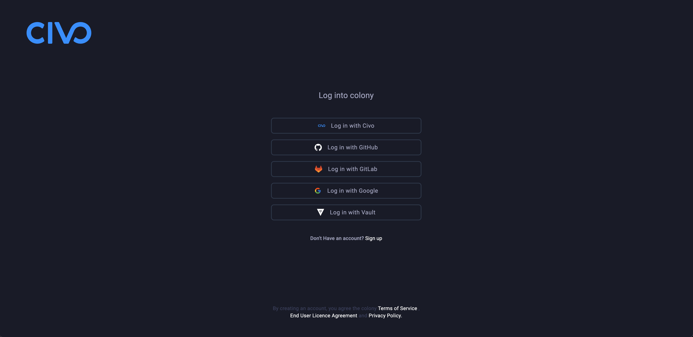
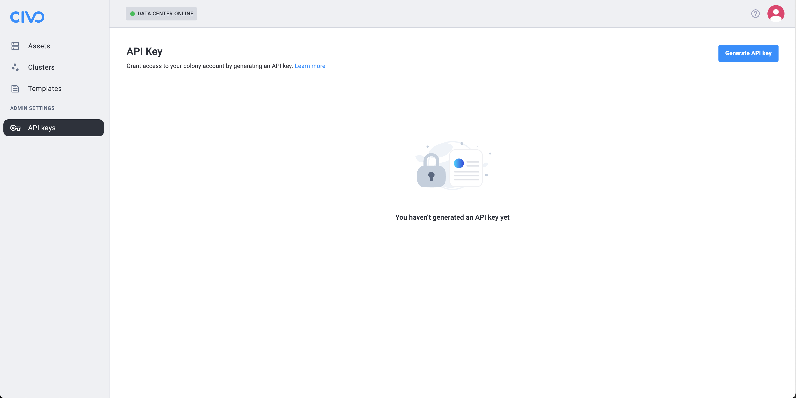
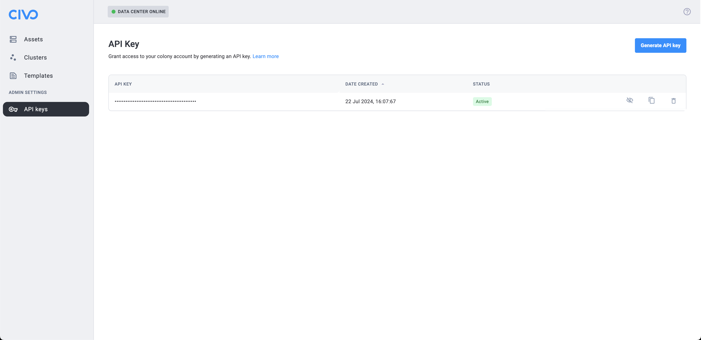
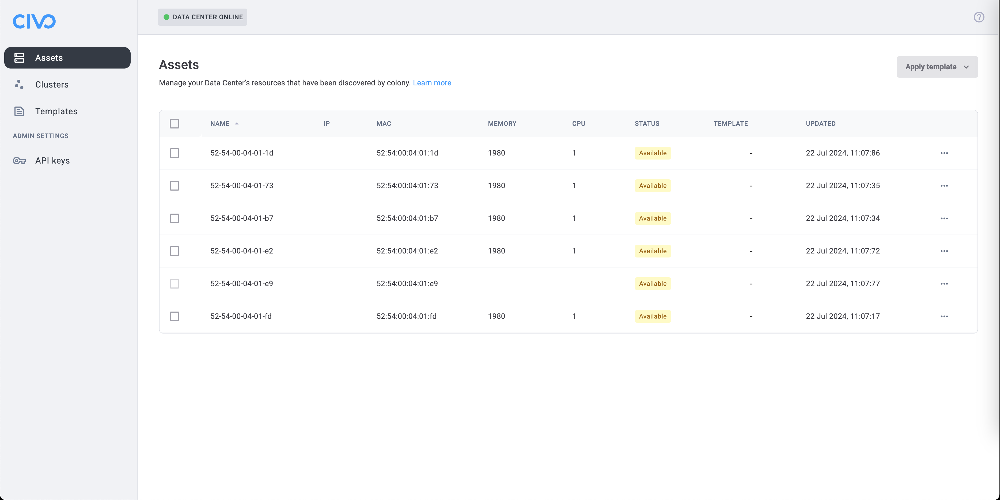

# Colony

colony is a bare metal provisioner and data center infrastructure management system. It's a cloud native microservice ecosystem with components hosted in konstruct cloud and other components that will run on your data centers. You need colony if you want to easily manage bare metal OS provisioning and deprovisioning operations in your own data centers.

## Get Started

To be able to run colony, you will need to be physically within your data center with a laptop.

### Prerequisites

To be able to run colony in your data center, you will need to install the colony CLI, have Docker Desktop running on your laptop and retrieve your colony API key.

#### colony CLI

The easiest way to install the colony CLI is using [Homebrew](https://brew.sh). Run this command in your terminal of choice:

```shell
brew install colony
```

If you need to upgrade the colony CLI, run:

```shell
brew update
brew upgrade colony
```

#### Docker Desktop

To install Docker Desktop on your machine, please follow [their instructions](https://docs.docker.com/get-docker/).

#### colony API key

To create a colony API key,first [sign-up to the colony management portal](https://colony-ui.mgmt-20.kubefirst.com/auth/signup).



You have the choice to create an account using the following providers:

- Civo
- GitHub
- GitLab
- Google

Once signed in, open the "API keys" page from the "ADMIN SETTINGS" section of the left sidebar.



Click on the "Generate API key": while your new key is being created, the button text will quickly change to "", and once it's done, you will see a new key added in your API keys page.



To copy your newly created API key, either use the Copy button, or manually show the API key value, select the text and copy it into your clipboard. This key will be useful to initialize colony.

### Install colony

TBD

### Discover your data center machines (physical or virtual)



TBD

## Next steps

Once our machines are available in the colony interface assets page, you have two choices:

1. Use one of [our template to install an operating system](templates/index.md) on one or multiple machines.
2. [Create one or multiple clusters](/clusters/index.md) on those machines.
