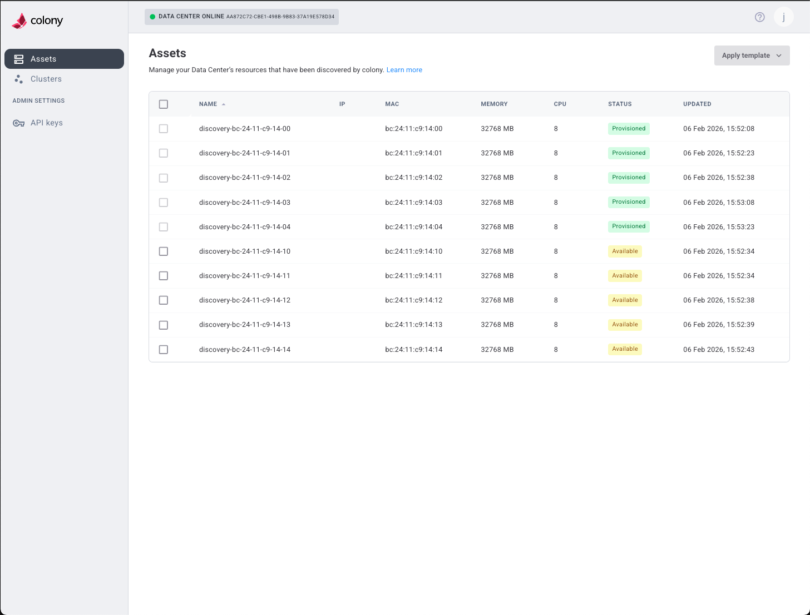
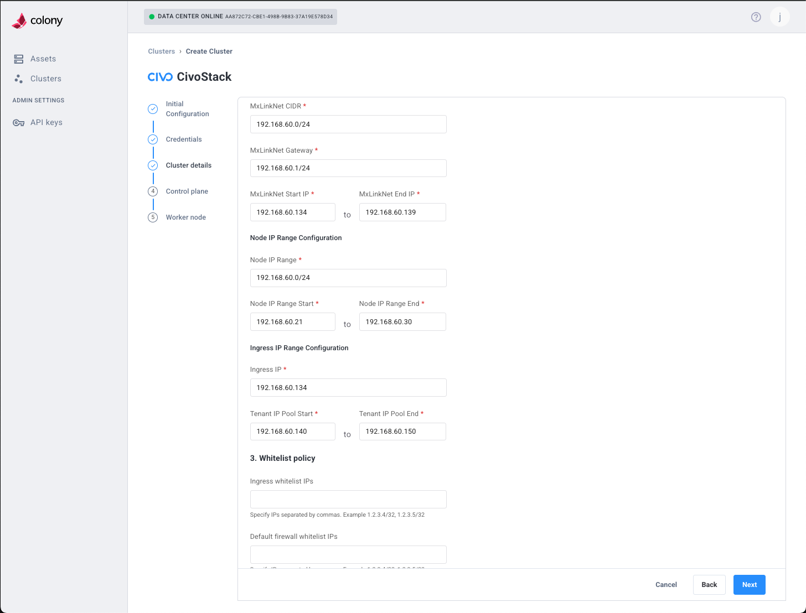
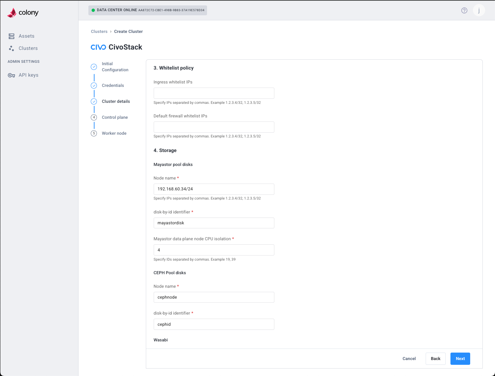
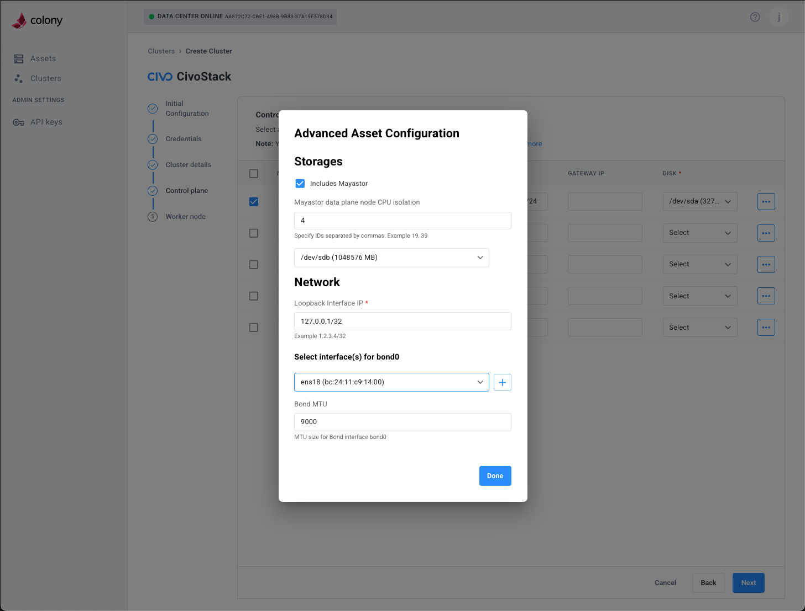
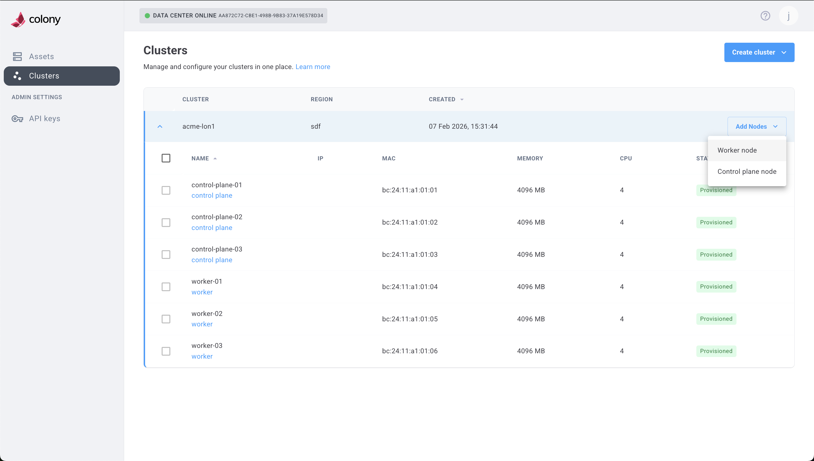
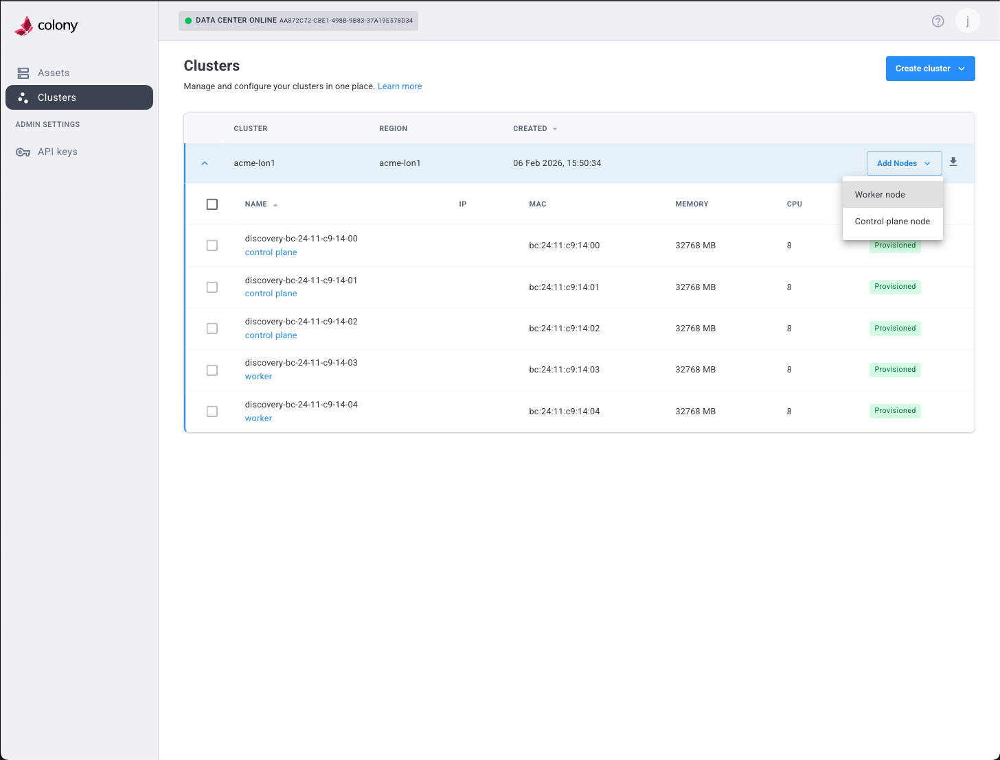
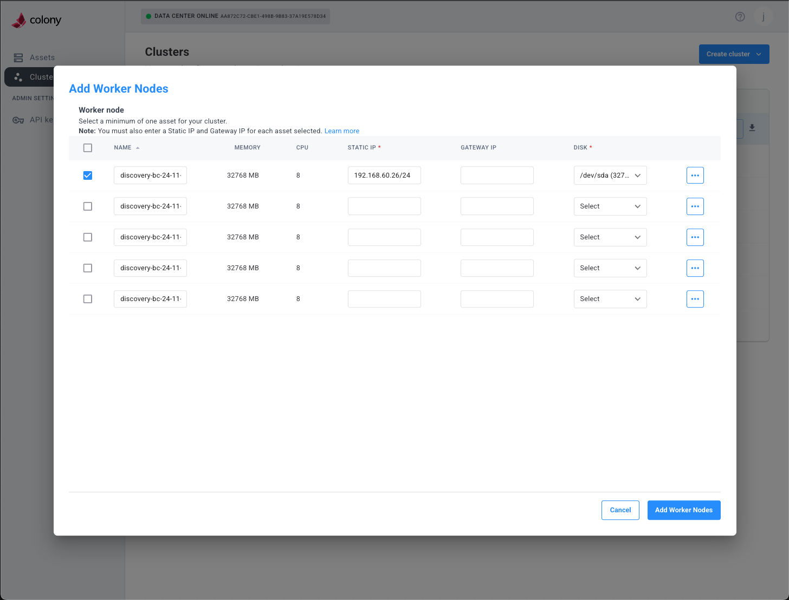
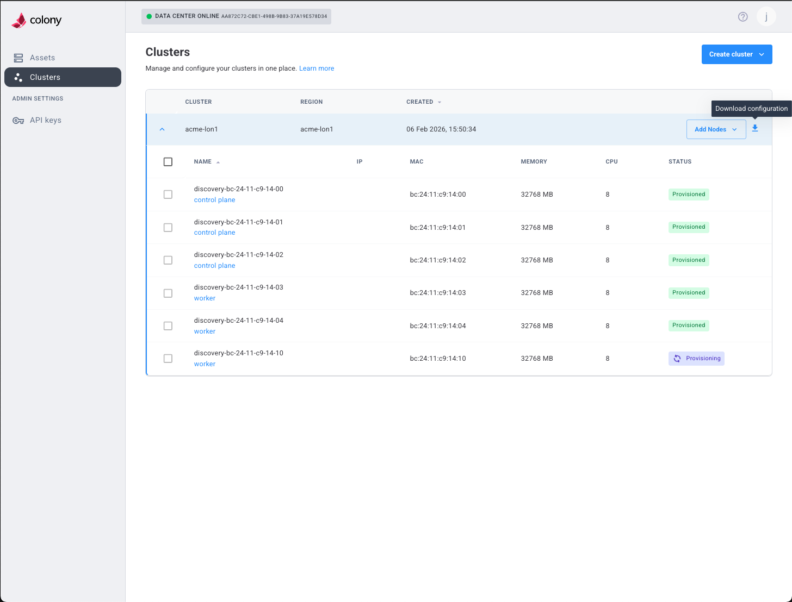

# Image Placement in Documentation

## Assets Documentation

### /docs/assets/index.md
-  - Show asset lifecycle with "available" status

### /docs/getting-started/discover-assets.md
-  - Show mixed asset statuses (provisioned/available)

## UI Walkthrough

### /docs/guides/ui-walkthrough.md
-  - Show Create Cluster dropdown

## Civo Stack Cluster Creation

### /docs/clusters/civo-stack/create.md
- Already has: initial-configuration.png (Step 2)
-  - Add for expanded Step 3 (Basic Details + Network)
-  - Add for IP ranges section
-  - Add for Storage configuration (Mayastor/CEPH)
-  - Add for Wasabi storage option
-  - Add for Advanced Asset Configuration modal
- Already has: control-plane.png (Step 3)
-  - Add for Worker node configuration (Step 4)
- Already has: provisioning.png (Provisioning status)

## Cluster Management (Post-Creation)

### /docs/clusters/add-nodes.md
-  - Show provisioning in progress
-  - Show cluster with all nodes provisioned
-  - Show Add Nodes dropdown menu
-  - Show Add Worker Nodes dialog

### /docs/clusters/civo-stack/create.md (Verification section)
-  - Show Download configuration button
-  - Show button hover state
